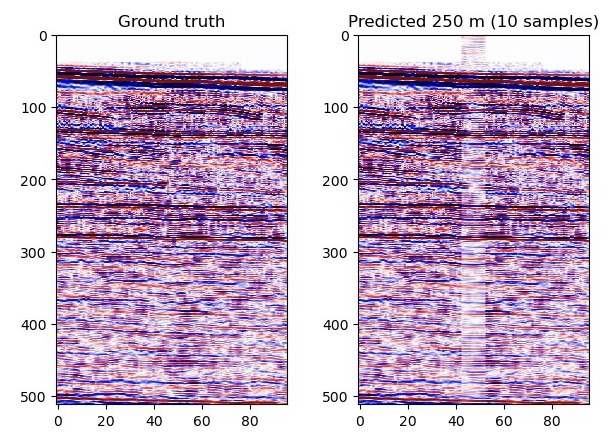
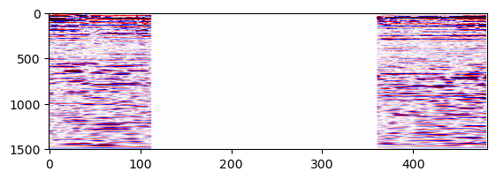
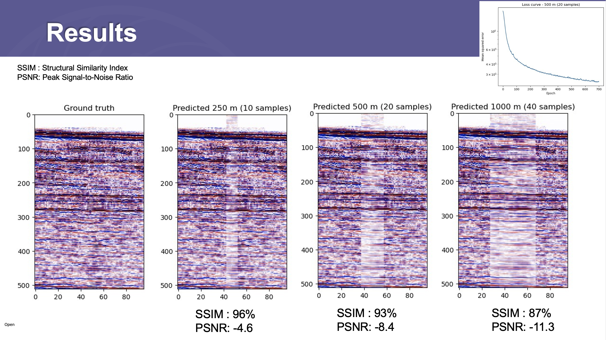

# APGCE Geohack2022 Group 2 - TriloBYTES



We joined the APGCE Geohack 2022 Hackathon on 25-27 November.

Our team:

1. Arvin Boutik Karpiah (Geophysicist)
2. Asiah Hanida Burhanuddin (Geologist)
3. Law May (Researcher)
4. N Farees Putra N Hassan (Geophysicist)
5. Syadhisy Dhanapal (Geophysicist)


## Challenge D: Seismic Intra-Offset Infill Challenge

We investigate the impact of increasing gap sizes on the accuracy of seismic intra-offset infill using a convolutional autoencoder.

## Data Extraction

Dataset: [Project Penobscot](https://terranubis.com/datainfo/Penobscot)

Data is extracted using `segysak`. Read iline at byte 21, xline at 9 and so on. `segysak` is preferred over `segyio` as it is able to:

1. Infill missing offset gathers with `np.nan`
2. Return data in non-flattened format: (iline, xline, twt, offset)

```python
import segysak.segy as sg

data = sg.segy_loader(seis_file, iline=21, xline=9, cdpx=73, cdpy=77, offset=37)
```

## Data Visualization

Visualizing IL1041, first offset of the seismic cross section. Notice the huge gap in the offset gathers.

```python
vmax = np.percentile(P_i1041, 97)
plt.imshow(P_i1041[0, :, :, 0].T, aspect=0.4, cmap='seismic_r', vmin=-vmax, vmax=vmax)
plt.show()
```


The team decided to use IL1121 (inline 1121) segy file for prediction.

## Data Patching

The twt (two-way-time) is limited to the top 512 out of 1501 samples, the 2D inline sections is cropped into 5 patches of 96 samples:

```python
# Dividing sections into 5 patches and limit the twt to 512 samples
compiled = []
hor = 96
start = 0
for i in range(start, 480, hor):
    data = P_i1121[:, i:i+hor, 0, :512]
    compiled.append(data)    
compiled = np.array(compiled)

# Swap the axes
patched = compiled.reshape(compiled.shape[0]*compiled.shape[1], compiled.shape[2], compiled.shape[-1])
patched = np.swapaxes(patched, 1, -1)
```

## Data Masking

Preparing the mask with increasing gap sizes 10, 20 and 40 samples, which is equivalent to offset distances of 250m, 500m, and 1000m.

```python
# No. of samples for missing interval
n_samples = 40 #10, 20, 40
distance = n_samples*25 #250m, 500m, 1000m respectively

# Masking
left = np.ones((96-n_samples)//2) #28, 38, 43
middle = np.zeros(n_samples)
single_layer = np.hstack((np.hstack((left, middle)), left))
mask = np.tile(single_layer, (patched.shape[1], 1))

x1_mask = np.repeat(np.expand_dims(mask, 0), patched.shape[0], axis=0)
y1_mask = 1-x1_mask
```

Applying the mask to the patched data:

```python
x1_data = patched*x1_mask
y1_data = patched*y1_mask
```

## Modelling

Autoencoder with 5 `Conv2D` layers as encoder, and 5 `Conv2DTranspose` layers as decoder.

```python
def cnn2d(input_shapes=input_shapes):
     
    filters = [8, 16, 32, 64, 128]
    kernel_size = [(3, 3)]
    
    inputs = tf.keras.layers.Input(shape=input_shapes, name='input')
    
    
    x = tf.keras.layers.Conv2D(filters=filters[0], kernel_size=kernel_size[0], padding='same')(inputs)
    x = tf.keras.layers.BatchNormalization()(x)
    x = tf.keras.layers.Activation('relu')(x)
    x = tf.keras.layers.Dropout(0.1)(x)
    x = tf.keras.layers.MaxPooling2D()(x)
    
    for i in range(1, len(filters)):
        x = tf.keras.layers.Conv2D(filters=filters[i], kernel_size=kernel_size[0], padding='same')(x)
        x = tf.keras.layers.BatchNormalization()(x)
        x = tf.keras.layers.Activation('relu')(x)
        x = tf.keras.layers.Dropout(0.1)(x)     
        x = tf.keras.layers.MaxPooling2D()(x)
    
    for i in range(len(filters), 1, -1):
        x = tf.keras.layers.UpSampling2D()(x)    
        x = tf.keras.layers.Conv2DTranspose(filters=filters[i-1], kernel_size=kernel_size[0], padding='same')(x)
        
    x = tf.keras.layers.UpSampling2D()(x) 
    outputs = tf.keras.layers.Conv2DTranspose(filters=1, kernel_size=kernel_size[0], padding='same')(x)
        
    model = tf.keras.Model(inputs=inputs, outputs=outputs, name="cnn2D_model")
    
    optimizer = tf.keras.optimizers.Adam(0.005)

    model.compile(loss='mse',  
        optimizer=optimizer,
        metrics=['mse']) 
    return model
```

## Results

Structural Similarity Index (SSIM) and Peak Signal-to-Noise ratio (PSNR) are used as the evaluation metrics to compare the predicted results and the ground truth. Depending on the gap size, we were able to perform seismic infill with SSIM between 87% to 96%.




## Learnings

1. Data is KING!
2. Prepare presentation pitch early! 
3. Pitching narrative > complexity of methodology or solution.

P.S. Panna Cotta arose because it was easier to enunciate than Penobscot
